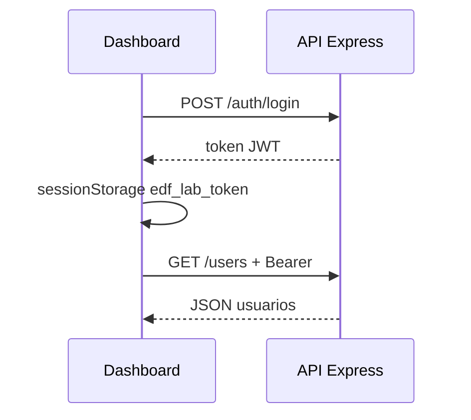

# Autenticación JWT en el laboratorio

Esta guía explica **quién puede llamar a la API** cuando activas la autenticación opcional del hito **v1.5**.

Por defecto (`AUTH_ENABLED` sin definir o `false`) la API sigue **abierta** como en v1.4. Las misiones 01–13 no cambian.

---

## ¿Qué problema resuelve?

Sin auth, cualquiera que alcance `http://localhost:3100/users` puede leer y modificar usuarios. En local es didáctico; en un servidor público conviene **exigir credenciales** en las rutas de usuarios.

El lab enseña el patrón más habitual en APIs REST: **JWT** (JSON Web Token) enviado como cabecera `Authorization: Bearer <token>`.

---

## Flujo completo

```txt
1. Cliente → POST /auth/login { username, password }
2. API    → 200 { token, expiresIn: 3600 }
3. Cliente guarda token (sessionStorage en el dashboard)
4. Cliente → GET /users con Authorization: Bearer <token>
5. API    → 200 [ usuarios ]
```



---

## Variable `AUTH_ENABLED`

Solo se considera activada si el valor es exactamente la cadena `true`:

```js
// api/auth.js
function isAuthEnabled() {
  return process.env.AUTH_ENABLED === 'true';
}
```

| Valor | Comportamiento |
|-------|----------------|
| sin definir / `false` | API abierta; `POST /auth/login` → **404** |
| `true` | Rutas `/users*` protegidas; login obligatorio para CRUD |

Plantilla de variables: [`api/.env.example`](../api/.env.example).

---

## Rutas públicas vs protegidas

Con `AUTH_ENABLED=true`:

| Ruta | ¿Token? |
|------|---------|
| `GET /`, `GET /health`, `GET /about`, `GET /time` | No |
| `POST /auth/login` | No (envía credenciales) |
| `GET/POST/PUT/DELETE /users` y `/users/:id` | **Sí** — Bearer JWT |

### Middleware `requireAuth`

```js
// api/auth.js — simplificado
function requireAuth(req, res, next) {
  if (!isAuthEnabled()) return next();

  const header = req.headers.authorization;
  if (!header || !header.startsWith('Bearer ')) {
    return res.status(401).json({ error: 'Token no proporcionado.' });
  }
  // jwt.verify(...) → req.user o 401 Token inválido o caducado
}
```

En `api/index.js` el router de usuarios se monta así:

```js
app.use('/users', auth.requireAuth, usersRouter);
```

---

## Login (`POST /auth/login`)

Cuerpo JSON:

```json
{ "username": "admin", "password": "tu-clave" }
```

Respuestas típicas:

| HTTP | Situación |
|------|-----------|
| **200** | `{ "token": "...", "expiresIn": 3600 }` |
| **400** | Falta `username` o `password` |
| **401** | Credenciales incorrectas |
| **404** | Auth desactivada |

### Ejemplos con `curl`

```bash
# Activar auth en la shell (sin dotenv)
export AUTH_ENABLED=true
export AUTH_USER=admin
export AUTH_PASSWORD=lab-secret
export JWT_SECRET=un-secreto-largo-minimo-32-caracteres
PORT=3100 npm start

# Login
curl -s -X POST http://localhost:3100/auth/login \
  -H 'Content-Type: application/json' \
  -d '{"username":"admin","password":"lab-secret"}'

# Sin token → 401
curl -s -o /dev/null -w "%{http_code}\n" http://localhost:3100/users

# Con token
TOKEN=$(curl -s -X POST http://localhost:3100/auth/login \
  -H 'Content-Type: application/json' \
  -d '{"username":"admin","password":"lab-secret"}' | jq -r .token)

curl -s http://localhost:3100/users -H "Authorization: Bearer $TOKEN"
```

> **Solo laboratorio:** las credenciales se comparan en texto plano con variables de entorno. En producción real usarías hashing, rotación de secretos y usuarios en base de datos.

---

## Dashboard vanilla

### Almacenamiento del token

```js
// dashboard/app.js
const TOKEN_STORAGE_KEY = 'edf_lab_token';

function setStoredToken(token) {
  sessionStorage.setItem(TOKEN_STORAGE_KEY, token);
}
```

| Almacén | Alcance | Por qué `sessionStorage` aquí |
|---------|---------|-------------------------------|
| `sessionStorage` | Pestaña actual | Al cerrar la pestaña, la sesión desaparece |
| `localStorage` | Persiste entre sesiones | Más cómodo pero más riesgo en equipos compartidos |

### `fetchJson` con Bearer

```js
async function fetchJson(path, options = {}) {
  const headers = { ...(options.headers ?? {}) };
  const token = getStoredToken();
  if (token) {
    headers.Authorization = `Bearer ${token}`;
  }
  // fetch ...
}
```

### 401 en la carga inicial

Si `/users` devuelve **401**, el dashboard muestra el **formulario de login** (no el error genérico «API no disponible»). Eso enseña la diferencia entre **sin red** y **sin permiso**.

---

## Códigos HTTP que debes conocer

| Código | Significado en este lab |
|--------|-------------------------|
| **401 Unauthorized** | Falta token, token inválido o credenciales de login mal |
| **403 Forbidden** | No lo usamos en v1.5 (sin roles) |
| **404** en `/auth/login` | Auth desactivada |

---

## Tests automatizados

```bash
cd api
npm run test:sqlite   # 16 tests base + 7 tests auth
npm run test:auth     # solo auth
```

---

## Qué no incluimos en v1.5

- OAuth2 / login social
- Refresh tokens
- Roles (RBAC)
- Login en dashboards React/Vue *(reto extra en Misión 14)*

---

## Enlaces

- Despliegue y Plesk: [`18-despliegue.md`](./18-despliegue.md)
- CORS (sigue siendo necesario): [`05-cors-explicado.md`](./05-cors-explicado.md)
- Misión práctica: [`missions/14-login-y-token.md`](../missions/14-login-y-token.md)
- OpenAPI: [`11-openapi.md`](./11-openapi.md), [`api/openapi.yaml`](../api/openapi.yaml)
